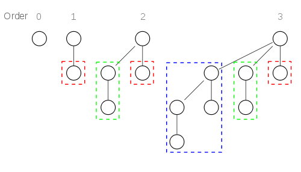

# Binomial Queue

Binomial Queue is a #[Priority Queue/Heap](202202062259.md) that seeks to
improve [Leftist Heap](202202121418.md)'s and [Skew Heap](202202141211.md)'s
Insert. Unlike those, it is a collection of [Linked List Tree](202112102106.md).

## Illustration



## Analysis

- Insert will result in $O(1)$.
- Merge and DeleteMin will result in $O(\log N)$.
- FindMin could result in $O(\log N)$ if the minimum is not known

## Implementation

```c
#ifndef _BinomialQueue_H

struct BinNode;
struct Collection;
typedef struct BinNode *Position;
typedef struct Collection *BinQueue;

BinQueue Initialise(void);
int IsEmpty(BinQueue H);
ElementType FindMin(BinQueue H);
BinTree CombineTrees(BinTree T1, BinTree T2);
BinQueue Merge(BinQueue H1, BinQueue H2);
ElementType DeleteMin(BinQueue H);

#endif
```

```c
struct BinNode {
  ElementType Element;
  Position    LeftChild;
  Position    NextSibling;
};

/**
 *  Return the result of merging equal-sized T1 and T2
 */
BinTree CombineTrees(BinTree T1, BinTree T2) {
  if (T1->Element > T2->Element)
    return CombineTrees(T2, T1);
  T2->NextSibling = T1->LeftChild;
  T1->LeftChild = T2;
  return T1;
}

/**
 *  Merge two binomial queues
 *  Not optimised for early termination
 *  H1 contains merged result
 */
BinQueue Merge(BinQueue H1, BinQueue H2) {
  BinTree T1, T2, Carry = NULL;

  if (H1->CurrentSize + H2->CurrentSize > Capacity)
    Error("Merge would exceed capacity");

  H1->CurrentSize += H2->CurrentSize;
  for (int i = 0, j = 1; j <= H1->CurrentSize; i++, j *= 2) {
    T1 = H1->TheTrees[i];
    T2 = H2->TheTrees[i];

    switch (!!T1 + 2*!!T2 + 4*!!Carry) {
      case 0: // No trees
      case 1: // Only H1
        break;
      case 2: // Only H2
        H1->TheTrees[i] = T2;
        H2->TheTrees[i] = NULL;
        break;
      case 4: // Only Carry
        H1->TheTrees[i] = Carry;
        Carry = NULL;
        break;
      case 3: // H1 and H2
        Carry = CombineTrees(T1, T2);
        H1->TheTrees[i] = H2->TheTrees[i] = NULL;
        break;
      case 5: // H1 and Carry
        Carry = CombineTrees(T1, Carry);
        H1->TheTrees[i] = NULL;
        break;
      case 6: // H2 and Carry
        Carry = CombineTrees(T2, Carry);
        H2->TheTrees[i] = NULL;
        break;
      case 7: // All Trees
        H1->TheTrees[i] = Carry;
        Carry = CombineTrees(T1, T2);
        H2->TheTrees[i] = NULL:
        break;
    }
  }

  return H1;
}

ElementType DeleteMin(BinQueue H) {
  int MinTree;    // The tree with the minimum item
  BinQueue DeletedQueue;
  Position DeletedTree, OldRoot;
  ElementType MinItem;

  if (IsEmpty(H)) {
    Error("Empty binomial queue");
    return -Infinity;
  }

  MinItem = Infinity;
  for (int i = 0; i < MaxTrees; i++) {
    if (H->TheTrees[i] && H->TheTrees[i]->Element < MinItem) {
      // Update minimum
      MinItem = H->TheTrees[i]->Element;
      MinTree = i;
    }
  }

  DeletedTree = H->TheTrees[MinTree];
  OldRoot = DeletedTree;
  DeletedTree = DeletedTree->LeftChild;
  free(OldRoot);

  DeletedQueue = Initialise();
  DeletedQueue->CurrentSize = (1 << MinTree) - 1;
  for (int j = MinTree - 1; j >= 0; j--) {
    DeletedQueue->TheTrees[j] = DeletedTree;
    DeletedTree = DeletedTree->NextSibling;
    DeletedQueue->TheTrees[j]->NextSibling = NULL;
  }

  H->TheTrees[MinTree] = NULL;
  H->CurrentSize -= DeletedQueue->CurrentSize + 1;

  Merge(H, DeletedQueue);
  return MinItem;
}
```
