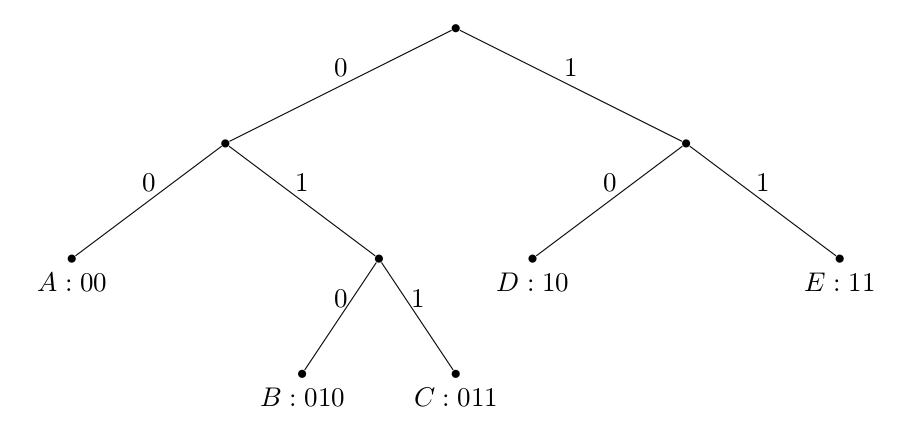

# Prefix Coding

Prefix Coding is a #[source coding technique](202209291028.md) which uniquely
codes the output of the source with **prefix code**. Prefix code is the code in
which no code word is the *prefix* of any other code word. In other words, if
the code set given has a code that can be a prefix for another code, then the
code set is not a prefix code, thus unsuited for Prefix Coding.

A much easier approach to identify whether a code set is a prefix code, is by
inspecting the code set's decision [Tree](202112101956.md)#. If there is no code
symbol get in the way, that is none of the symbol is the ancestor for another
symbol, then the code set is a prefix code. Notice that the symbols are the
leaves of the tree.

**Note**: The [Source Encoder](202209291038.md) will always start in an initial
state, which should be the root of the tree.

In the meantime, the prefix code must satisfy the [Kraft-McMilan Inequality](202210102310.md)#.
