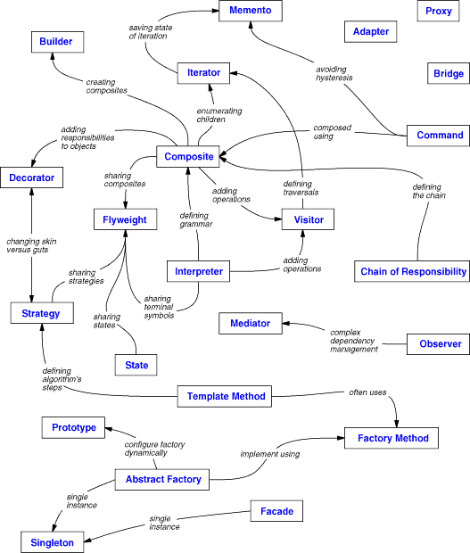

# Design Pattern

Design Pattern is a communicating object and class that is customised to solve a
general design problem in a particular context.[^gangOfFour] It abstrats and
identifies the key aspects of a common design structure that make an object and
class reusable.

We know that an application, a toolkit or a framework needs to be redesign using
a Design Pattern when:
- the creation of an object needs to explicitly specify a class
- there is a dependency on specific operations
- there is a dependency on hardware and software platform
- there is a dependency on object representations or implementations
- there is a dependency on algorithms
- the coupling is tight (highly depending classes on each other)
- functionality extension have to be done by subclassing
- it is unable to alter classes conveniently

Design Patterns could be roughly classified into three categories:
- Creational Design Patterns
- Structural Design Patterns
- Behavioural Design Patterns

Several Design Patterns are presented below:
- [State Pattern](202210211637.md)
- [Null Object Pattern](202211162216.md)
- [Observer Pattern](202211231132.md)
- [Singleton Pattern](202211231900.md)
- [Mediator Pattern](202211241530.md)
- [Composite Pattern](202302101843.md)
- [Strategy Pattern](202302172008.md)
- [Factory Method](202302232101.md)
- [Decorator](202302232121.md)
- [Memento](202302232319.md)
- Flyweight (share component in [Composite Pattern](202302101843.md))
- Iterator (traverse [Composites](202302101843.md))
- Adapter (gives object new interface)

Figure below shows the relationship between each Design Pattern:

[^gangOfFour]: Design Patterns: Elements of Reusable Object-Oriented Software
