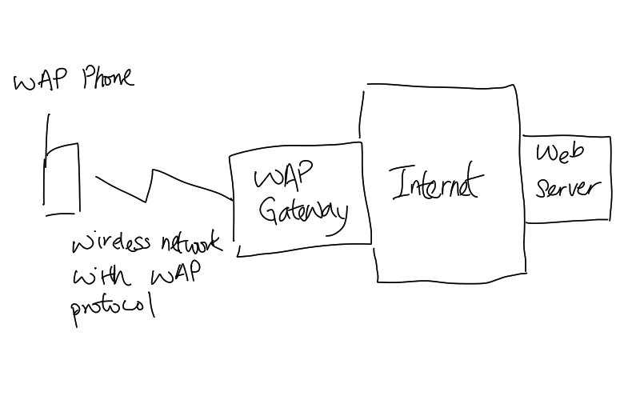

# Wireless Access Protocol (WAPv2)

WAPv2 is an open, global specification that empowers [mobile users](202303292141.md)
with [wireless](202303301607.md) devices to easily access and interact with
information and services instantly. ~~[Protocol](202209302229.md) for mobile
wireless connection~~ It is intended for data entry or display on [cellular phones](202303292214.md).
It has a complete protocol stack similar to [Internet Protocol (IP)](202206151223.md)
but optimised for wireless information pull and push [Transport Layer](202206131837.md)
and above across multiple wireless technologies. The protocol stack contains
[Wireless Application Environment (WAE)](202305171408.md), [Wireless Session Protocol (WSP)](202305171416.md),
[Wireless Transaction Protocol (WTP)](202305171420.md), [Wireless Datagram Protocol (WDP)](202305171433.md),
and [network bearers](202303292214.md). Transport layer security is provided by
[Wireless Transport Layer Security (WTLS)](202305171438.md).

The following figure shows a rough picture of the WAP architecture:

However, WAP technology has been made obsolete since most mobile browsers have
full compatibility to the modern web standard such as HTML.
