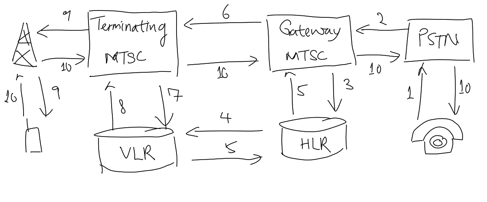

# Global System for Mobile Communications (GSM)

GSM is a [Second-Generation Cellular Network (2G)](202303311222.md) technology
that utilises [Time-Division Multiple Access (TDMA)](202303301637.md) and
Gaussian Minimum Frequency Shift Keying (GMSK). It has a symmetric downstream
and upstream speed of 14.4 Kbps, with available frequencies of 900 MHz, 1800 MHz
(DCS 1800), and 1900 MHz (DCS 1900), and a dedicated 200 kHz bandwidth for voice
communication. GSM's radio channel is 200 kHz wide and is divided into 8-time
slots frame. It uses 124 channels per [cell](202303292214.md) where each cell
can support up to 992 users (minimum 8 users). It is usually displayed as 2G in
[mobile connection](202303292147.md). 

**Note**: Some channels are used for transmitting control signal.

GSM signalling protocol provides radio #resource management (controls set-up,
termination, and [hand-offs](202305111947.md) of radio channels), mobility
management (location and security using [MTSO](202305111959.md)), connection
management, mobile application part (MAP) between [Home Location Register (HLR)](202303312031.md)
and [Visitor Location Register (VLR)](202303312030.md), and
[Base Transceiver Station (BTS)](202305162145.md) management.

GSM network can be broadly categorised into [Mobile Station](202305162139.md),
[Base Station System (BSS)](202404111123.md), [Network Switching System (NSS)](202404111124.md),
[Operation Support Subsystem (OSS)](202404111135.md).

The following figure shows the underlying working mechanism of GSM location
service:

1. A call is made to a mobile unit.
2. PSTN recognises the number and delegates it to the gateway [Mobile Switching Centre (MSC)](202305081828.md).
   or MTSC.
3. MSC or MTSC initiates a query on the user's [Home Location Register (HLR)](202303312031.md).
4. HLR interrogates [Visitor Location Register (VLR)](202303312030.md) the
   currently serving user by roaming the number request.
5. The corresponding routing number returns the HLR and then to the gateway.
6. The call is routed to the terminating MSC or MTSC.
7. The MSC asks VLR to correlate the call to the subscriber.
8. VLR complies.
9. Mobile unit is paged or called.
10. The mobile unit responds to the call, and the MTSCs convey the information
    back to the original request initiator.

**Note**: GSM subscriber units are generic until a subscriber identity module
(SIM) is inserted.
