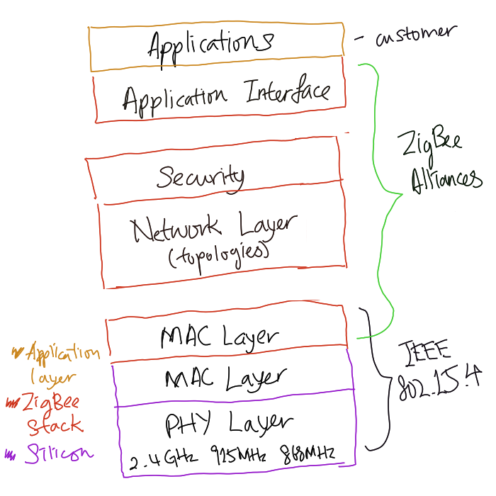

# ZigBee

ZigBee is a set of high level protocols designed for lower power, low data
rates, secure, and reliable [Wireless Personal Area Network (WPAN)](202303292149.md)
based on [IEEE 802.15.4](202304271819.md) standard. It could either use 2.4 GHz
or 868/915 MHz band with the data rates of 250 kbps, 20 kbps, or 40 kbps
respectively. The range it covered ranged from 5 to 500 metre based on the
environment. It is optimised for low duty-cycle applications and typically used
in sensor networks, industrial monitoring and control (asset tracking), home
automation (smart home), personal health care, PC and peripherals, gaming and
automotive solutions, hospital care, and remote [wireless](202303301607.md)
microphone configuration. It yields high [Throughput](202304111957.md) and low
[Latency](202304111955.md) for these kinds of applications. Like [IEEE 802.11](202303292155.md),
its [MAC mechanism](202303301623.md) is [CSMA/CA](202304262143.md).

The protocol stack, based on IEEE 802.15.4 defined [PHY Layer](202206131647.md)
and [MAC layer](202303301623.md), provides [Network Layer](202206131702.md),
security, and application interface defined by [ZigBee Alliance](202304271814.md).
The following figure shows the entirety of the ZigBee protocol stack:

Multiple topologies are supported in ZigBee, that are star, peer-to-peer, and
mesh. Each of them requires a PAN coordinator to store node device database
(FFD and RFD, defined by IEEE 802.15.4), transaction table, and pairing table.

Comparing to [Bluetooth](202304212236.md), it is reliable and self-healing,
supports large number of nodes (up to 65536), easy to deploy (extendable), has
very long battery life (low power requirement), secure
([128-AES](202209012213.md)), low cost, can be used globally, and has faster
network join time. It also has a large address space, combination of 64-bit IEEE
and 16-bit short addresses, that can potentially support up to 18.45 quintillion
devices.
