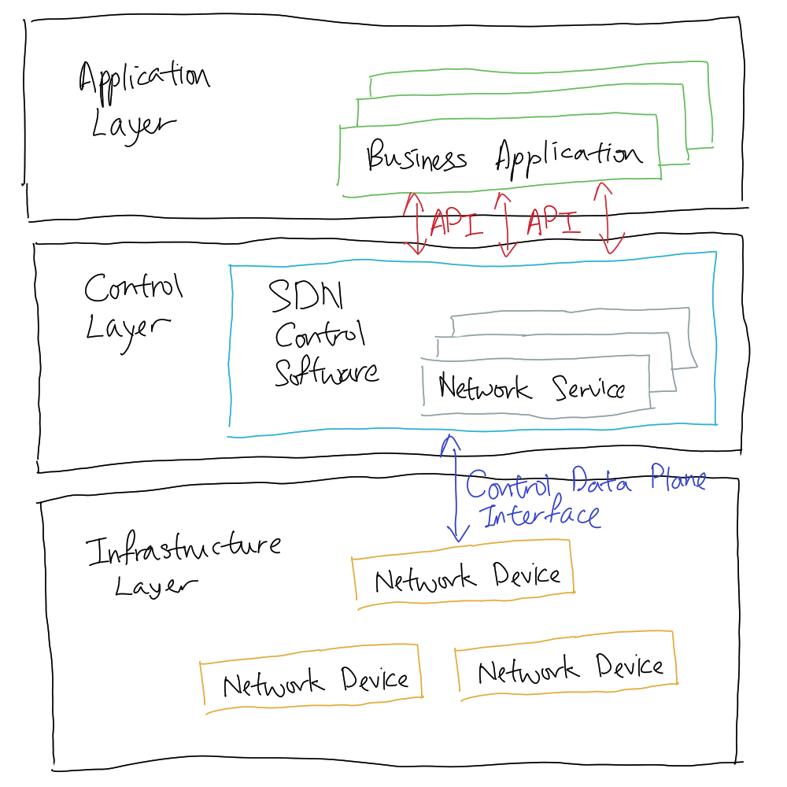

# Software Defined Network (SDN)

SDN is a new network architecture approach that enable network to be agile,
flexible, intelligently and centrally controlled using software applications. It
aims to enhance to the network #performance that allows network operator to
consistently and holistically manage the entire network. It could be understand
as a concept of the physical separation of the network control plane from the
forwarding plane, and where a control plane controls several [Network Devices](202207051821.md).

Conceptually, its architecture consists of three layers, that is **application
layer**, **control layer**, and **infrastructure layer**. Application layer
provides a space to deploy restrain function ([Intrusion Detection System (IDS)](202303081739.md),
[Firewall](202301211140.md)) or network applications ([Load Balancing](202210242151.md))
compare to traditional network that needs specialised appliance. Control layer
serves as a brain of the SDN that uses centralised SDN controller software
(deployed on a server) to manage policies and traffic flow all over the network.
Infrastructure layer is simply a layer made up from physical [Network Devices](202207051821.md).
The following figure shows the layer hierarchy and their interaction:

For control layer, there will be a controller component with *northbound* and
*southbound* interfaces with different responsibilities. Northbound interface
allows a particular component of a network to communicate with a higher-level
component and describes the area of protocol-supported communication between the
controller and applications or higher layer [Control Programs](202305151920.md).
On the other hand, southbound interface allows a particular network component to
communicate with a lower-level component and enables the communication between
the controller and the network nodes, either physical or virtual, so that the
[Router](202207061800.md) can discover [Network Topology](202304211303.md),
define network flows, and implement requests delegated to it. In a [Data Centre](202210012205.md),
northbound APIs are responsible for management solutions for automation and
orchestration, and the sharing of actionable data between systems. Southbound
APIs are responsible for the communication with the switch fabric, network
virtualisation protocols, or integration of a distributed computing network.

Corresponding to the above SDN architecture's layers, from the highest to the
lowest, it has **management plane** (consisting applications or [Control Program](202305151920.md)),
**control plane** (like [Network Operating System](202305151917.md)), and **data
plane** (network devices). The communication between the control plane and data
plane, that is the *control data plane interface*, could be established via
[OpenFlow](202305151926.md). The management plane is where the network
configuration and tuning done including [Traffic Engineering](202305040730.md),
[Access Control List (ACL)](202302190738.md) configuration, device provisioning
etc. Control plane computes the forwarding state in the routers which affect
routing, traffic engineering, and failure detection or recovery. Data plane is
responsible for processing and delivery of packets based on local forwarding
state and the packet header. Filtering, buffering, and scheduling of the packets
are done in data plane.

Using SDN, the network is programmable via external software independent of
physical devices to manage network behaviour, providing great customisation
opportunities to networks in support with new service. The control on bandwidth
management, restoration, #security, policies etc. are intelligent and
centralised for optimisation. Physical hardware and connection are logically
separated with the services and applications, and can be interacted via APIs
instead, thus making the connections between network infrastructure flexible. In
addition, SDN enables multivendor interoperability and vendor-neutral ecosystem.
