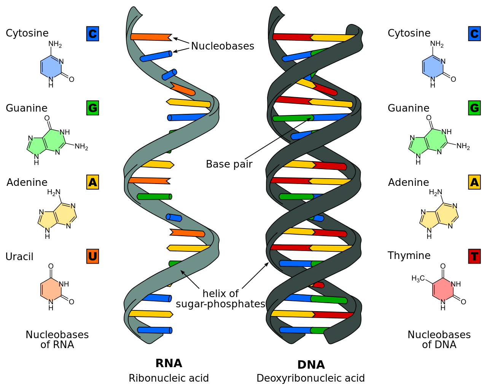

# Nucleic Acid

Nucleic acid is a long liner polymers made of monomers known as nucleotides. It
usually consists of a 5-carbon sugar (**deoxyribose** for DNA or **ribose** for
RNA), a **nitrogen base** (generic **adenine**, **guanine**, and **cytosine**,
**thymine** for DNA, and **uracil** for RNA), and **phosphate groups**. Purines
(two-carbon nitrogen ring bases) and pyrimidines (one-carbon nitrogen ring
bases) form the base paring with hydrogen bonds. It is then linked together by
phosphodiester bonds between sugars and bases. Nucleic acid could be terminated
by either 5' or 3' end, called 3', 5'-phosphodiester bond.

**Note**: The purine adenine (A) always pairs with the pyrimidine thymine (T),
and the pyrimidine cytosine (C) always pairs with the purine guanine (G).

There are two nucleic acids which are **deoxyribonucleic acid or DNA**
(antiparallel double-stranded, thymine as base, deoxyribose as sugar) and
**ribonucleic acid or RNA** (single-stranded, uracil as base, ribose as sugar).
DNA is responsible for maintaining protein-encoding information and can't
function as an enzyme. In contrast, RNA is the protein-encoding information
carrier that controls the information usage, and can function as an enzyme.
