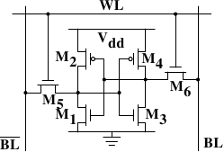

# Static RAM (SRAM)

A typical SRAM cell contains 6 transistors as shown in the following diagram:

SRAM requires constant power to maintain the cell states which is assessable
immediately once the word access line (WL) is raised. There is no need of
refreshing the charge.

SRAM is used as [CPU Cache](202403191017.md) due to its nearly identical speed
to CPU. Since most of the modern [Computer Architectures](202403151651.md) are
not directly connected to front size bus (FSB), all communications between CPU
and other devices (mainly main memory) should pass through CPU caches in theory.
It is impossible to replace [Dynamic RAM (DRAM)](202403142052.md) with SRAM
alternative due to economical reason.

**Note**: In reality, CPU designers may implement different design choices on
the interface of the caches such that the data flow need not pass through any of
the higher-level caches on the way from the core to main memory.
