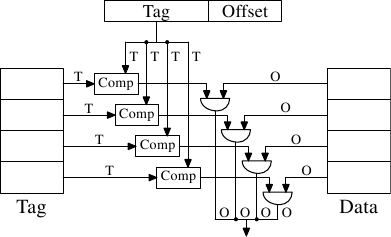
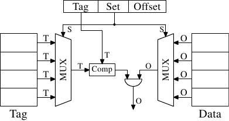
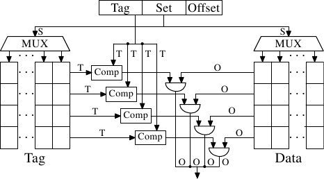

--- tags: [hardware, logic, caching, memory] ---

# Cache Associativity

Cache associativity solves the problem in which many memory locations may fight
for each place in the [CPU Cache](202403191017.md). The industrial standard for
cache associativity level for L1d and L2 caches, at least according to Drepper,
are 8 and 16 respectively. Generally, the higher the associativity, the lower
the possibility of the cache miss. However, there is an implementation limit on
associativity level as anything pass 16-way set associativity will be incredibly
hard, which forces the processor designer to put in L3 cache for aid.

**Note**: The associativity will be havled in dual-core environment or
quartered for quad-core.

There are three main implementations on this problem: **fully associative
cache**, **direct-mapped cache**, and **set-associative cache**.

A *fully associative cache* is designed so that each cache holds a copy of any
memory location. The processor core compares tags of each and every cache line
with tag for the requested address. The requested address's tag comprises the
whole address which is not offset to the cache line, meaning that it doesn't
belong to any of the cache set. However, it is only practical for small caches
such as [Translation Lookaside Buffer (TLB)](202403210922.md) as it requires
huge effort on keeping up the performance. This is because the cache designer
has to merge as many set of data lines as there are cache buckets, and there are
heavy requirements on the amount of transistors for comparator for its fast
computation. The following figure shows an example architecture of such cache:

*Direct-mapped cache* takes a different approach in which each tag is strictly
maps to exactly one cache entry. The low 6 bits are index to the cache line
whereas the remaining 16 bits are used to directly address each entry. It is a
relatively simple cache architecture as it requires only one comparator, one
multiplexer (ignoring the data line), and some logic circuits. The concerns on
this implementation is that the number of transistors in multiplexer grows
$O(\log N)$, as $N$ is the number of cache lines. Meaning, if the requirements
on the number of cache lines increase, the multiplexer will become more and more
complex and costly. Furthermore, it only works well if the address used by the
program are evenly distributed with respect to bits used for direct mapping. If
this is not the case, it may lead to cache entries starvation in which some
cache lines may not able to be used once. The following figure shows the cache
structure:

In contrast, *set-associative cache* combines the above cache architectures into
a hybrid structure in which the tag and data storage are divided into sets which
are selected by the address and the tags for all set members are compared in
parallel. Small number of values is cache for the same set value. As the cache
grows in size, only the number of columns, that is the values, should be
increase. The number of rows should be only increased when there is an increase
in associativity. The figure below depicts such architecture:

If data cache is less than full associative, and if not all addrress bits are
used to select a cache line designate the same page, mapping between virtual
address and physical frame matters as it affects the runtime performance.
