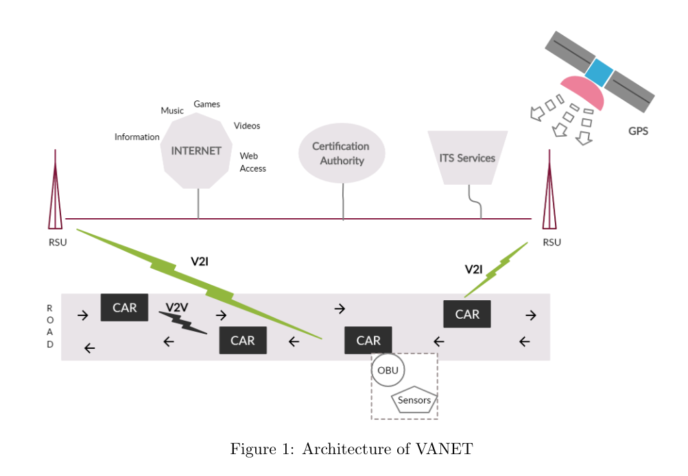

# Vehicular Ad-hoc Network (VANET)

VANET is seen by both [Hameed et al.](lit/@Hameed2022.md) and [Faisal et al.](lit/@Faisal2020.md)
a type of [Mobile Ad-Hoc Network (MANET)](202304151351.md) that focuses on
mobile nodes. It is often the centre of discussion in Intelligent Transport
System (ITS). The objectives of VANET, as stated by Hameed et al., is to offer
safety and security for the road users by aggregating accidents or uncertain
conditions and traffic data. It has a limited bandwidth (75 MHz) which has a
maximum theoretical [Throughput](202304111957.md) of 27 Mbps.

Compare to MANET, it has *high node mobility, high node density, high topology
change, and high computational power*. It uses *regular mobility model, close to
ground radio propagation model (where LoS is not available), and localisation
technologies such as GPS, AGPS (Assisted GPS), and DGPS (Differential GPS)*.
[(Hameed et at., 2022)](lit/@Hameed2022.md) The node's moving pattern is
constrained by the road, with a communication range up to 500 m compare to
MANET's 100 m and medium to high node speed (20 to 100 km/hour compare to
MANET's 6 km/hour). VANET is highly scalable with high [QoS](202209282057.md).
Both Hameed et al. and [Faisal et al.](lit/@Faisal2020.md) agreed that VANET
requires low energy or power constraints due to the deployment of long-life
batteries for OBUs (on-board units).

According to Hameed et al., there are 6 communication ways: **Vehicle-to-Vehicle
(V2V)**, Vehicle-to-Sensor (V2S), **Vehicle-to-Infrastructure (V2I)**,
Intra-Infrastructure (I2I), Vehicle-to-Personal Device (V2PD), and
Vehicle-to-Cellular Infrastructure (V2CN). The primary ways to communicate are
V2V and V2S. (Faisal et al., 2020)

For V2V, US Federal Communication Commission (FCC) allocated **75 MHz spectrum
at 5.9 GHz**, in addition of IEEE's [Dedicated Short Range Communication (DSRC)](202507311721.md)
technology, which its primary model is [IEEE 802.11p](202507311724.md). (Hameed
et al., 2022) There is no need of infrastructure support as it creates
self-network that can range from 200 up to 1000 metre (Cheng and Liu, 2020). The
communication between vehicles is done using OBU, in which it will share
information such as safety messages, vehicle identities, and information on
malicious vehicle. (Faisal et al., 2020) Improvement to DSRC is done in the form
of 802.11bd, a standard that is backward compatible and interoperable with
802.11p, with its bandwidth upgraded to 20 MHz. ([Zhou, 2022](lit/@Zhou2022.md))

Later, LTE-V2X PC5 interface Mode 4 was adopted into VANET for [Physical Layer](202206131647.md)
and [Data Link Layer](202206131651.md) definition for V2V communication. It is
seen as a [cellular](202303292214.md) alternative to DSRC. NR-V2X was developed
within 5G-NR domain, with the aim to further improve performance and
reliability. (Zhou, 2022)

In V2I, LTE-A is mostly employed to alert potential road hazards. (Hameed et al.
2022) The communications are done between RSU (road-site unit) and OBU on
information such as road conditions and non-safety services such as nearby hotel
and gas station. At the same time V2I, through RSU, provides internet access to
the vehicle. (Faisal et al., 2020) RSU is equipped with network devices, which
extend the communication range by relaying and runs safety application. (Hameed
et al., 2022).

In the case of I2I, RSUs communicate with each other through wired or wireless
medium. They are connected to the Internet, Certificate Authority (from Faisal
et al., 2020) or Trust Authority (Cheng and Liu, 2020), and ITS services. The
following illustration shows the architecture of VANET.

When designing a security scheme for VANET, Trust Authority (TA) is the focus
point for some researchers. According to [Cheng and Liu (2020)](lit/@Cheng2020.md),
TA is a fully trusted third party, responsible for generating system parameters
and registration of vehicles and RSUs. It is also responsible for tracking the
true identity of malicious vehicle in security sense. In such context, RSU is
also needed to generate pseudonym and private key for vehicles.

**Note**: The data rate in I2I is constant regardless of network topology or
distance while in V2V or V2I this varies. (Hameed et al., 2022)
