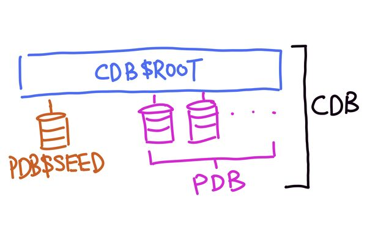

# Multitenant Container Database (CDB)

CDB is a database that allows for one or more [self-contained schema and objects](202607152342.md)
that can be plugged or unplugged from CDB and appear to the user as a database
in of itself.

Each CDB can have up to maximum 252 PDBs. It consists of `CDB$ROOT`, `PDB$SEED`
and [PDB(s)](202607152342.md). The following image shows the simplified
architectural view of CDB.

`CDB$ROOT` is the root container that contains Oracle metadata and common
users' data. This includes data files from *SYSTEM*, *SYSAUX*, *UNDO*, and
*TEMP* and other files from *REDO* and *CONTROL*. (See more in [Oracle Tablespace](202607152324.md))

`PDB$SEED` is a template used to create new PDB(s).

For PDB, see [Pluggable Database (PDB)](202607152342.md).
