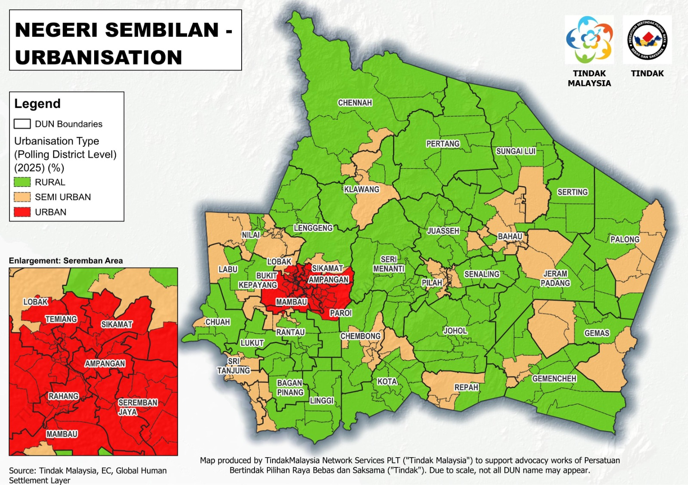

# Negeri Sembilan Demographic Map Series

Pivoting to urbanisation level, Negeri Sembilan is an urban state. According to
statistics provided by Kementerian Kemajuan Desa & Wilayah, the population
distribution for Negeri Sembilan by urbanisation is:

2023: 70.2% urban, 29.8% rural (Malaysia: 75.7% urban, 24.3% rural) 2025: 70.7%
urban, 29.3% rural (Malaysia: 76.0% urban, 24.0% rural)

**Note**: Urban in Malaysia includes metropolitan and major towns as per DOSM's
definition. (DOSM, Department of Statistics Malaysia)

Based on our methodology of studying electorate size and the Global Human
Settlement Layer, here is Tindak Malaysia's breakdown of voter count by
urbanisation class

2023: 33.0% urban, 37.4% semi-urban, 29.6% rural 2025: 33.4% urban, 37.4%
semi-urban, 29.1% rural.

Some of the fastest-growing DUNs in Negeri Sembilan are urban areas like
Sikamat, Bukit Kepayang, and Paroi. Having said that, there is depopulation
taking place in the heart of Seremban.

DUN Nilai and DUN Labu (both semi-urban) are experiencing fast-paced growth as
land is being opened for new housing estates (Nilai can be said to have grown by
8% in comparison to the 2023 voter count - highest growth in the state).

Rural areas are experiencing stagnant, near-stagnant, and some depopulation.

Do you think the election campaigns of this election reflect urbanisation trends
or not? Share your views with us.
